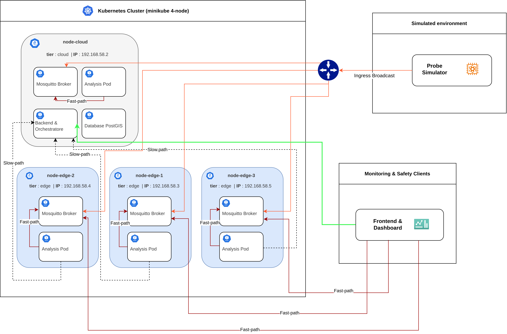

# Context-Aware Edge Deployment for Smart Event Crowd Monitoring

Distributed, **Context-Aware** (Edge/Cloud) platform based on **Kubernetes** for real-time crowd density and public safety monitoring during large-scale public events.

The system ingests and processes continuous streams of synthetic radio frames (Wi-Fi/BLE probe sniffing), estimates pedestrian density using dedicated edge analysis microservices, dynamically orchestrates computational workload placement based on geospatial latency and CPU load, and issues ultra-low-latency emergency alerts via a **Dual-Path** communication paradigm.

---

## System Architecture and Components

The system architecture is deployed on a multi-node Kubernetes cluster (1 central Cloud node and 3 perimeter Edge nodes) and is structured into the following cooperating modules:



* **Crowd Simulator (`simulator/`)**: A Python module based on Markov chains parameterized by zone type. It models pedestrian movement and emits radio probe frames, broadcasting them concurrently to all MQTT brokers across the system.


* **Distributed MQTT Brokers (`k8s/mosquitto.yaml`)**: A dedicated Eclipse Mosquitto instance hosted on each cluster node (both Cloud and Edge). It exposes TCP port `1883` for probe ingestion and intra-node pod communication, as well as WebSocket port `9001` for real-time push delivery to web clients.


* **Edge Analysis Service (`eventAnalysis/`)**: A containerized Java/Spring Boot microservice. Dynamically instantiated with a dedicated pod for each defined geographic area, it processes probe streams over sliding windows and calculates crowd density and accumulation trends using linear regression.


* **Management Backend and Geospatial Engine (`eventManagement/`)**: A Spring Boot application hosted on the Cloud node. It integrates PostgreSQL/PostGIS to persist spatial geometries (polygonal areas and node coordinates) and evaluate minimum geodetic distances via native queries.


* **Context-Aware Orchestrator (`eventManagement/src/.../orchestration/`)**: A periodic control loop running within the backend that monitors cluster health, CPU utilization, and area priorities. It evaluates a multi-criteria cost function to automate analytical container placement and live migration via the Kubernetes API.


* **Operator Dashboard (`event-frontend/`)**: A reactive frontend console built with React, TypeScript, and Leaflet. It enables interactive management of maps, areas, nodes, and scheduling policies while displaying real-time alerts and node operational metrics.


### Dual-Path Communication Paradigm

Data egress from peripheral analysis services is governed by two asymmetric, parallel communication routes tailored to message criticality[cite: 2]:

* **Fast-Path (Reactive / Emergencies)**: When critical overcrowding or dangerous congestion trends are detected (e.g., three consecutive cycles of `HIGHLY_RISING`), the analysis pod immediately publishes the alert to the local Mosquitto broker on its host node. The notification is delivered directly to the frontend via WebSocket within a few milliseconds ($\sim 1\text{--}3\,\text{ms}$), completely bypassing cloud transit and database persistence.


* **Slow-Path (Persistence / Historical Storage)**: At the close of each observation window, the pod sends an aggregated JSON summary via HTTP REST to the central backend for long-term storage in PostgreSQL/PostGIS and time-series modeling.


---

## System Prerequisites

Ensure the following tools and runtimes are installed on the host machine prior to starting the system:

* **Docker Engine** (v24.0+)
* **Minikube** (v1.30+) and **kubectl**
* **Java JDK 17+**
* **Python 3.10+** with `venv` support
* **Node.js** (v18+) and **npm**

---

## Step-by-Step Getting Started Guide

### 1. Environment and Permissions Setup

Grant execution permissions to all automation scripts across the repository[cite: 1]:

```bash
chmod +x *.sh eventManagement/*.sh eventAnalysis/*.sh
```

Set up the virtual environment and install dependencies for the Python simulator[cite: 1]:

```bash
cd simulator
python3 -m venv .venv
source .venv/bin/activate
pip install -r requirements.txt
cd ..
```

Verify or configure the `.env` file in the project root containing settings for database connections, analysis thresholds, and MQTT endpoints[cite: 1].

---

### 2. Multi-Node Kubernetes Cluster Provisioning

Execute the provisioning script using the `--pf` flag to automatically establish all required port-forwarding tunnels[cite: 1]:

```bash
./start_cluster_pf.sh --pf
```

The script executes the following automated workflow[cite: 1]:

* Starts a 4-node Minikube cluster using the `edge-cluster` profile[cite: 1].
* Labels the cluster nodes (`node-cloud` with `tier=cloud`, and `node-edge-1`, `node-edge-2`, `node-edge-3` with `tier=edge`)[cite: 1].
* Enables and patches the `metrics-server` with a 10-second sampling resolution for accurate CPU monitoring[cite: 1].
* Pre-loads the `polinux/stress-ng` container image into the Minikube node cache to eliminate pull latency during testing[cite: 1].
* Creates the `event-analysis-config` ConfigMap from `.env` and applies base manifests in `k8s/` (PostGIS, Mosquitto, ServiceAccount, RBAC, and Backend)[cite: 1].
* Executes local container build and redeployment scripts for Java services (`eventManagement` and `eventAnalysis`)[cite: 1].
* Opens background `kubectl port-forward` tunnels[cite: 1]:
* Backend REST API: `http://localhost:8080`[cite: 1]
* Cloud MQTT Broker: TCP port `1883`[cite: 1]
* Edge MQTT Brokers (1, 2, 3): TCP ports `1884`, `1885`, `1886`[cite: 1]


* Launches the Minikube dashboard in the background[cite: 1].

---

### 3. Geospatial Scenario Bootstrap

In a new terminal window, initialize the event layout and geographic coordinates by running[cite: 1]:

```bash
./setup_scenario.sh
```

This script automates the following actions[cite: 1]:

* Triggers synchronization of Kubernetes nodes into the PostGIS database via `/api/nodes/sync-k8s`[cite: 1].
* Assigns physical GPS coordinates to Edge and Cloud nodes around Piazza Maggiore in Bologna[cite: 1].
* Creates the target event record[cite: 1].
* Registers 6 georeferenced areas modeled as PostGIS polygons (`entrata`, `corridoio`, `stage`, `stand`, `food`, `uscita`), each configured with capacity and priority attributes[cite: 1].
* Automatically triggers the instantiation and scheduling of dedicated `event-analysis` pods on Kubernetes for each monitored area[cite: 1].

---

### 4. Operator Dashboard Launch (Frontend)

Open a dedicated terminal, install dependencies, and launch the development server[cite: 1]:

```bash
cd event-frontend
npm install
npm run dev
```

The dashboard will be accessible in your browser at `http://localhost:5173` (or the port reported in the terminal)[cite: 1].

> **Browser Permissions Note**: Upon first loading the application, grant permission for native browser notifications to receive real-time critical alerts emitted over the Fast-Path.
> 
> 

---

### 5. Running the Crowd Simulation

In a separate terminal, launch the stochastic simulator to start synthetic radio frame generation and broadcast transmission[cite: 1]:

```bash
./start_sim.sh
```

The generator queries the registered areas, instantiates the synthetic pedestrian population, and broadcasts probe batches across all cluster MQTT brokers simultaneously. The dashboard will display live headcounts, density metrics, forecast charts, and dynamic area risk status updates.

---

## Resilience Testing and Chaos Engineering

The platform supports dynamic fault-tolerance and overload-handling verification[cite: 2, 5]:

### 1. CPU Overload Simulation (Overload Avoidance)

You can inject a 95% synthetic CPU workload onto an Edge node directly via the infrastructure panel in the dashboard or by executing:

```bash
kubectl run cpu-stress --image=polinux/stress-ng --restart=Never \
  --overrides='{"spec": {"nodeSelector": {"node-id": "node-edge-2"}}}' \
  -- --cpu 0 --cpu-load 95 --timeout 180s
```

* **Expected Behavior**: At the next control loop tick, the orchestrator detects that node CPU utilization exceeds the 75% threshold, assigns a heavy penalty to the congested node, and selectively evicts lower-priority pods toward idle edge nodes or the Cloud while keeping critical areas locally anchored[cite: 2, 5].

### 2. Node Failure Simulation (Failover and Failback)

By unscheduling and isolating an Edge node from cluster scheduling[cite: 2, 5]:

```bash
kubectl cordon edge-cluster-m02
```

* **Expected Behavior**: The orchestrator detects the unschedulable state, assigns an infinite cost to the active allocation, and executes an immediate failover bypassing hysteresis[cite: 2, 5]. Once the node is uncordoned (`kubectl uncordon edge-cluster-m02`), the cost function re-evaluates the configuration and authorizes a controlled return (failback) only if the net cost reduction exceeds the hysteresis threshold[cite: 2, 5].

---

## Maintenance and System Teardown

### Live Configuration Reload

If configuration parameters in `.env` are updated (e.g., trend angles, database credentials), apply changes to the ConfigMap and reload deployments without restarting Minikube[cite: 1]:

```bash
./update_env.sh
```

### Stopping the Infrastructure

To cleanly terminate background processes (port-forwarding, simulator, dashboard), purge analysis pods, and stop the Minikube cluster[cite: 1]:

```bash
./stop_all.sh
```

---

## Repository Structure

```text
.
├── docker-compose.yaml        # Local auxiliary configurations
├── setup_scenario.sh          # Bootstrap script for nodes, event, and areas in PostGIS
├── start_cluster_pf.sh        # Starts Minikube cluster, tunes metrics, deploys, and sets up port-forwarding
├── start_cluster.sh           # Alternative basic cluster startup script
├── start_sim.sh               # Startup script for Python crowd traffic simulator
├── stop_all.sh                # Complete system teardown and cleanup procedure
├── update_env.sh              # Live propagation of .env variables to Kubernetes deployments
├── deploy/                    # Static configuration files for Mosquitto brokers
├── k8s/                       # Kubernetes manifests for PostGIS, Mosquitto, RBAC, and Backend
│   └── patches/               # Tuning patch for metrics-server (10-second sampling resolution)
├── eventManagement/           # Spring Boot Backend (REST, PostGIS, Orchestrator Control Loop)
├── eventAnalysis/             # Java Spring Boot microservice for perimeter area analysis
├── event-frontend/            # Operator dashboard built with React, TypeScript, Leaflet, and WebSockets
└── simulator/                 # Stochastic crowd mobility simulator based on Markov chains
```